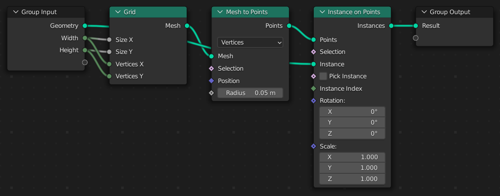

A scripting API for Blender's Geometry Nodes:

<table>
<tbody>
<tr>

<td>

```python
from geometry_script import *

@tree("Repeat Grid")
def repeat_grid(geometry: Geometry, width: Int, height: Int):
    g = grid(
        size_x=width, size_y=height,
        vertices_x=width, vertices_y=height
    ).mesh_to_points()
    return g.instance_on_points(instance=geometry)
```

</td>
<td>



</td>
</tr>
</tbody>
</table>

## Installation
1. [Download the source code](https://github.com/carson-katri/geometry-script/archive/refs/heads/main.zip)
2. Open *Blender* > *Preferences* > *Add-ons*
3. Choose *Install...* and select the downloaded ZIP file

Or you can get it from the [Blender Market](https://www.blendermarket.com/products/geometry-script).

## What is Geometry Script?
*Geometry Script* is a robust yet easy to use Python API for creating Geometry Nodes with code.

At a certain point, Geometry Node trees become unmanagably large. Creating node trees in Python enables quicker editing and reorganization of large, complex trees.

*Geometry Script* has all of the performance and capabilities of Geometry Nodes, but in a more managable format. The scripts are converted directly to Geometry Node trees making them easy to tweak for others unfamiliar with scripting.

## [Documentation](https://carson-katri.github.io/geometry-script/)
Read the documentation for more information on installation, syntax, and tutorials.
