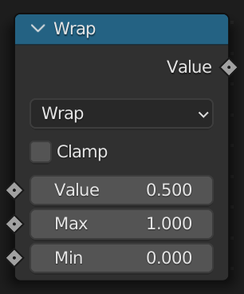
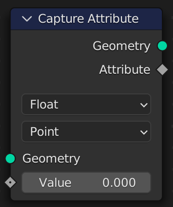

# Using Nodes

Node functions are automatically generated for the Blender version you are using. This means every node will be available from geometry script.

This means that when future versions of Blender add new nodes, they will all be available in Geometry Script without updating the add-on.

To see all of the node functions available in your Blender version, open the *Geometry Script* menu in the *Text Editor* and click *Open Documentation*.


This will open the automatically generated docs page with a list of every available node and it's inputs and outputs.

## How nodes are mapped
All nodes are mapped to functions in the same way, so even without the documentation you can decifer what a node will equate to. Using an [IDE with code completion](../../setup/external-editing.md) makes this even easier.

The general process is:
1. Convert the node name to snake case.
2. Add a keyword argument (in snake case) for each property and input.
3. If the node has a single output, return the socket type, otherwise return an object with properties for each output name.

> Properties and inputs are different types of argument. A property is a value that cannot be connected to a socket. These are typically enums (displayed in the UI as a dropdown), with specific string values expected. Check the documentation for a node to see what the possible values are for a property.

## Enum Properties

Many nodes have enum properties. For example, the math node lets you choose which operation to perform. You can pass a string to specify the enum case to use. But a safer way to set these values is with the autogenerated enum types. The enums are namespaced to the name of the node in PascalCase:

```python
# Access it by Node.Enum Name.Case
math(operation=Math.Operation.Add)
math(operation=Math.Operation.Subtract)
math(operation='MULTIPLY') # Or manually pass a string
```

Internally, this type is generated as:

```python
import enum
class Math:
  class Operation(enum.Enum):
    Add = 'ADD'
    Subtract = 'SUBTRACT'
    Multiply = 'MULTIPLY'
    ...
  ...
```

The cases will appear in code completion if you setup an [external editor](../../setup/external-editing.md).

## Duplicate Names

Some nodes use the same input name multiple times. For example, the *Math* node has three inputs named `value`. To specify each value, pass a tuple for the input:

```python
math(operation=Math.Operation.Wrap, value=(0.5, 1, 0)) # Pass all 3
math(operation=Math.Operation.Wrap, value=(0.5, 1)) # Only pass 2/3
math(operation=Math.Operation.Wrap, value=0.5) # Only pass 1/3
```



## Examples

Here are two examples to show how a node maps to a function.

### Cube


1. Name: `Cube` -> `cube`
2. Keyword Arguments
    * `size: Vector`
    * `vertices_x: Int`
    * `vertices_y: Int`
    * `vertices_z: Int`
3. Return `Geometry`

The node can now be used as a function:

```python
cube() # All arguments are optional
cube(size=(1, 1, 1), vertices_x=3) # Optionally specify keyword arguments
cube_geo: Geometry = cube() # Returns a Geometry socket type
```

The generated documentation will show the signature, result type, and [chain syntax](./sockets.md#chained-calls).

#### Signature
```python
cube(
  size: VectorTranslation,
  vertices_x: Int,
  vertices_y: Int,
  vertices_z: Int
)
```

#### Result
```python
mesh: Geometry
```

#### Chain Syntax
```python
size: VectorTranslation = ...
size.cube(...)
```

### Capture Attribute



1. Name `Capture Attribute` -> `capture_attribute`
2. Keyword Arguments
    * Properties
        * `data_type: CaptureAttribute.DataType`
        * `domain: CaptureAttribute.Domain`
    * Inputs
        * `geometry: Geometry`
        * `value: Vector | Float | Color | Bool | Int`
3. Return `{ geometry: Geometry, attribute: Int }`

The node can now be used as a function:

```python
result = capture_attribute(data_type=CaptureAttribute.DataType.Boolean, geometry=cube_geo) # Specify a property and an input
result.geometry # Access the geometry
result.attribute # Access the attribute
```

The generated documentation will show the signature, result type, and [chain syntax](./sockets.md#chained-calls).

#### Signature
```python
capture_attribute(
  data_type: CaptureAttribute.DataType,
  domain: CaptureAttribute.Domain,
  geometry: Geometry,
  value: Vector | Float | Color | Bool | Int
)
```

#### Result
```python
{ geometry: Geometry, attribute: Int }
```

#### Chain Syntax
```python
geometry: Geometry = ...
geometry.capture_attribute(...)
```