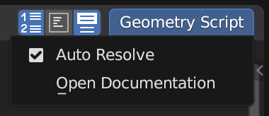

# External Editing

Blender's *Text Editor* leaves a lot to be desired. Writing scripts without code completion can be tough.
Using an external code editor is one way to improve the editing experience.

This guide will show how to setup [Visual Studio Code](https://code.visualstudio.com/) to edit Geometry Scripts. However, the same concepts apply to IDEs.

> This guide assumes you have already installed Visual Studio Code and setup the [Python extension](https://marketplace.visualstudio.com/items?itemName=ms-python.python). If not, please follow the setup guides for those tools before continuing.

## Code Completion
When the Geometry Script add-on starts, it generates a Python typeshed file that can be used to provide code completion.
All we have to do is add the right path to the Python extension's configuration:

1. Open Blender preferences and expand the *Geometry Script* preferences
2. Copy the *Typeshed Path*

3. In VS Code, open the Settings UI (`Shift+CTRL+P` or `Shift+CMD+P` > `Preferences > Open Settings (UI)`)
4. Find the setting `Python > Analysis: Extra Paths`
5. Click *Add Item*, then paste in the path copied from Blender and click *OK*

6. Create a new Python file, such as `Repeat Grid.py` and start writing a script. As you type, you should get helpful suggestions for every available node.

## Linking with Blender
Writing a script is great, but we want to see it run in Blender. Thankfully, Blender's Text Editor lets us link with an external file, and a simple tool from Geometry Script can make the process more seamless:

1. Open a *Text Editor* space.
2. Click the open button in the top of the editor, and navigate to your Python file.
3. Click the gear icon or press *N*, and uncheck *Make Internal*. This will ensure that changes made outside of Blender can be easily brought in.
4. Click *Open Text*.

5. At the top right of the Text Editor, open the *Geometry Script* menu and enable *Auto Resolve*. Enabling this feature will make the text data-block in Blender update every time you save the file outside of Blender.

6. To enable hot reload, open the *Text* menu and enable *Live Edit*. This will re-run your Geometry Script whenever it changes, updating the node tree live.

And that's it! You're setup to start writing scripts. In the next section we'll take a look at the API, and all of the things you can do with it.