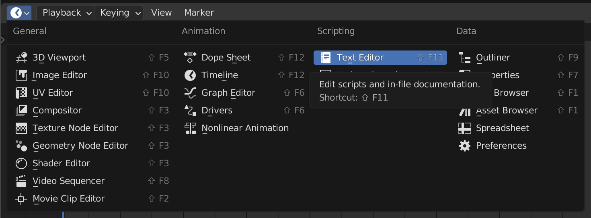
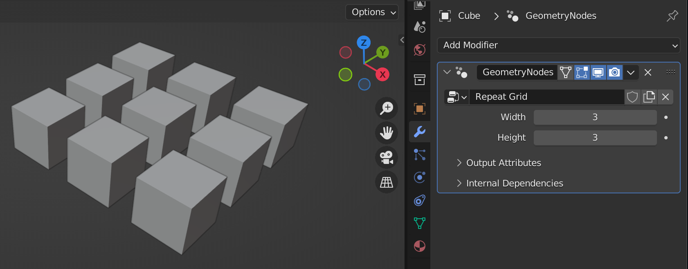

# Internal Editing Basics

The fastest way to get up and running is with Blender's built-in *Text Editor*.
You can edit and execute your scripts right inside of Blender:

1. Open a *Text Editor* space.



2. Create a new text data-block with the *New* button.


3. Start writing a Geometry Script. As an example, you can paste in the script below. More detailed instructions on writing scripts are in later chapters.

```python
from geometry_script import *

@tree("Repeat Grid")
def repeat_grid(geometry: Geometry, width: Int, height: Int):
    g = grid(
        size_x=width, size_y=height,
        vertices_x=width, vertices_y=height
    ).mesh_to_points()
    return g.instance_on_points(instance=geometry)
```

4. Click the run button to execute the script. This will create a Geometry Nodes tree named *Repeat Grid*.


5. Create a *Geometry Nodes* modifier on any object in your scene and select the *Repeat Grid* tree.

